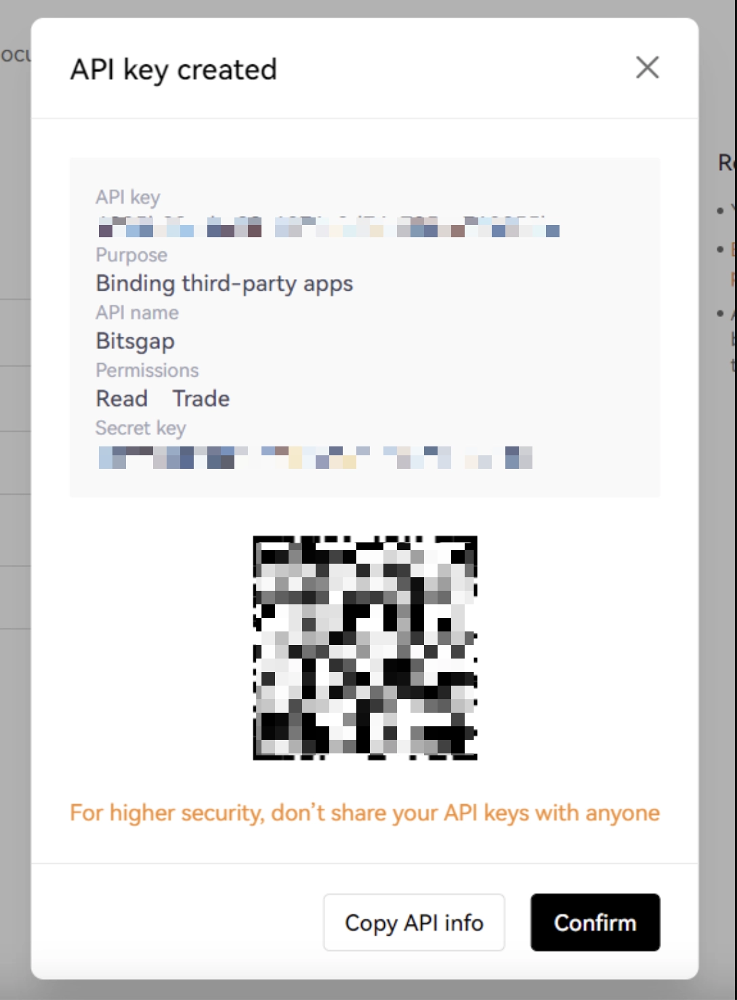

# OKX API密钥创建与配置完整指南

---

想在Bitsgap平台上使用OKX进行自动化交易？API密钥就是连接两者的桥梁。本文手把手教你两种对接方式：快速OAuth授权和手动配置——无论你是追求效率的老手，还是希望精细控制的新人，都能找到适合自己的方案。

---

## 什么是OKX Fast API?为什么推荐优先使用?

OKX Fast API基于OAuth 2.0协议,实现了"免输密钥"的一键授权。相比手动配置,它最大的优势是**安全性高**——你无需复制粘贴API密钥和密码短语,避免了泄露风险;同时**操作快**,整个流程不到1分钟。

### 开始前的准备工作

进入OKX交易页面,点击**交易 > 合约**,然后点击右上角的设置图标:

确保以下两项配置正确:
- **账户模式**:选择"单币种保证金"
- **持仓模式**:选择"单向持仓"

**重要提示**:如果你打算做合约交易,强烈建议使用**逐仓保证金模式**。这样即使某个仓位爆仓,也不会影响账户其他资产——相当于给每笔交易单独上了保险。

### 在Bitsgap完成快速连接

登录Bitsgap后,前往**我的交易所**页面,点击[添加新交易所]:

从列表中选择OKX,然后点击**快速连接**选项,接着点击[连接]:

### 授权并完成对接

系统会跳转到OKX官方页面,输入你的OKX账号密码登录:

阅读并授权Bitsgap请求的权限。**别担心隐私问题**——这些权限仅允许Bitsgap代替你执行交易指令,不会获取你的密码、邮箱等敏感信息。

授权成功后,页面会自动跳回Bitsgap。在**我的交易所**列表中,OKX会显示**已连接**状态,同时能看到你的交易余额:

到这里,快速连接就搞定了。如果你需要更精细的权限控制,继续往下看手动配置方法。

---

## 手动配置API密钥:适合需要自定义权限的场景

### 创建V5版本API密钥

点击[创建V5 API密钥]按钮:

选择API用途为**关联第三方应用**,并从下拉菜单中选择**Bitsgap**:

### 配置密钥参数和权限

为API密钥起个容易识别的名字(比如"Bitsgap自动交易"),然后**创建并牢记你的Passphrase**(密码短语)——这个密码后面无法找回,务必保存好。

👉 [注册OKX并开启API交易,享受更低手续费率](https://www.okx.com/join/62834398)

接下来设置权限开关:
- **读取权限**:开启
- **交易权限**:开启

完成安全验证(邮箱或手机验证码),确认创建。

### 保存并对接到Bitsgap

创建成功后,系统会显示API密钥和Secret密钥。**重要**:这两串字符只会显示一次,务必立即复制到安全的地方:

回到Bitsgap的**我的交易所**页面,点击[添加新交易所]:

选择OKX,依次粘贴你的API密钥、Secret密钥和Passphrase,点击[连接]:

### 验证连接状态

在**我的交易所**列表中,确认OKX显示**已连接**状态,并且能看到账户余额:

---

## 总结:选对方法事半功倍

如果你只是想快速上手自动交易,**OKX Fast API**是最优选择——安全、快捷、零失误。而需要定制化权限管理(比如只给特定子账户授权)的用户,手动配置能提供更灵活的控制。无论选哪种方式,👉 [通过OKX官方渠道注册](https://www.okx.com/join/62834398),都能享受更低的交易手续费和更稳定的API服务——这对高频交易用户尤其重要。
